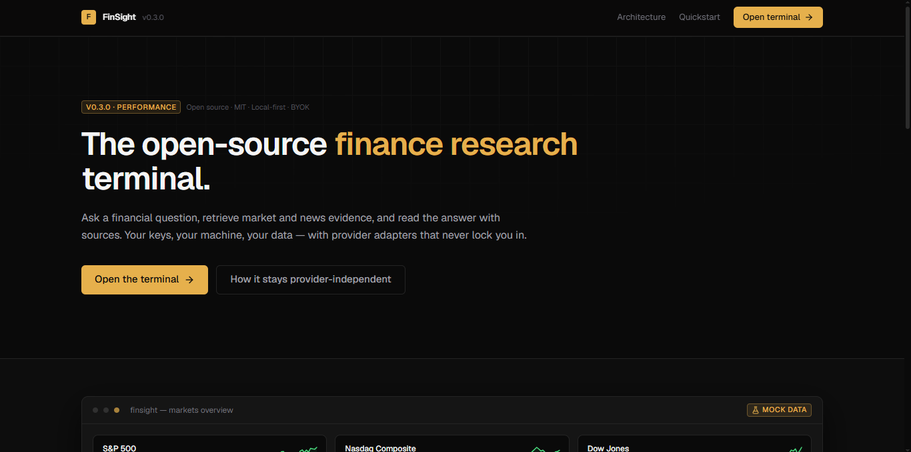
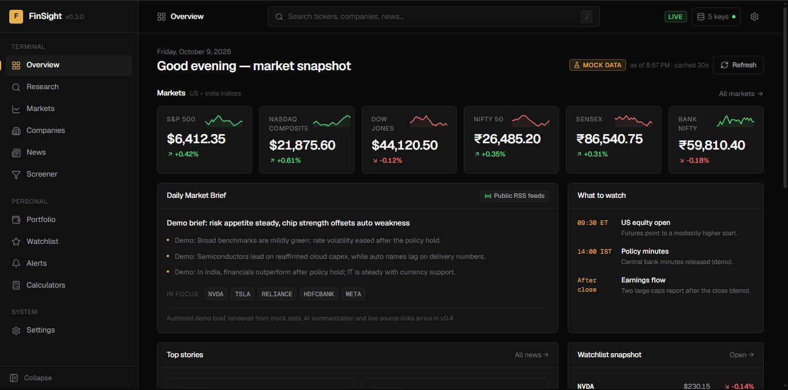

# FinSight

**An open-source, local-first, BYOK finance research terminal.**

[](https://github.com/ks2483735-afk/finsight/releases) [](https://github.com/ks2483735-afk/finsight/blob/main/LICENSE)

**Latest release:** [v0.3.0 — Performance & Reliability](https://github.com/ks2483735-afk/finsight/releases/tag/v0.3.0)

Ask a financial question → FinSight retrieves market and news evidence → your selected AI provider interprets it → you get an answer with sources. Evidence and AI interpretation are always kept clearly separate.

> **Status: v0.3.0 — Performance & Reliability.** Builds on the live-data foundation with improved request deduplication and caching, provider request timeouts, refreshed UI screenshots, and README updates. Live market data is available through Finnhub and Alpha Vantage, with news ingestion through public RSS feeds. AI interpretation is still planned and is not included in this release. FinSight never presents demo data as live data.

---

## 📸 FinSight in action

### Landing page



### Overview dashboard



---

## What works today (v0.3.0)

| Area | State |
| --- | --- |
| Landing page + terminal shell (sidebar, header, global search) | ✅ |
| Dark financial-terminal design system (tokens, components, states) | ✅ |
| Overview dashboard (indices, brief, stories, focus, watchlist, movers) | ✅ |
| Research pipeline UI (steps → evidence → observations → AI status) | ✅ |
| Markets / Companies / News / Screener pages | ✅ |
| Watchlist, Portfolio, Alerts — CRUD backed by local SQLite | ✅ |
| Calculators (SIP, Lumpsum, CAGR, Compound, EMI, Dividend) | ✅ deterministic |
| BYOK Settings (store keys, enable/disable, honest connection tests) | ✅ |
| Provider architecture (interfaces, registry, fallback chain, TTL cache and request deduplication) | ✅ |
| Finnhub live market-data adapter | ✅ |
| Alpha Vantage live market-data adapter | ✅ |
| Public RSS news adapter (no API key required) | ✅ |
| NewsAPI adapter | ✅ available; requires a NewsAPI key |
| Google Gemini adapter | ⏳ Planned — not implemented |
| AI answers / citations | ⏳ Planned — not implemented |
| Earnings/events and SEC/MCA filings ingestion | ⏳ v0.5 |
| Alert evaluation & notifications | ⏳ v0.7 |

## Pinokio

FinSight includes a Pinokio launcher for one-click local installation and startup. Pinokio can install the Node dependencies, launch the local Next.js server, open the Web UI, update dependencies, and reset generated build artifacts. The launcher does not include or request any API keys; FinSight remains BYOK.

After cloning the repository into Pinokio, use **Install** and then **Start**. Pinokio apps can also be installed directly from a public GitHub repository URL; verified apps are separately listed in Pinokio's Discover catalog.

## Quickstart

### Standard Node.js setup

Requirements: Node.js with npm and Git.

```bash
git clone https://github.com/ks2483735-afk/finsight.git
cd finsight
npm install
npm run dev
```

Then open the local URL printed by Next.js (normally `http://localhost:3000`).

Zero-key mode works out of the box. FinSight can run without provider API keys and clearly labels demo/mock data when a live provider is unavailable.

### Optional — bring your own keys (BYOK)

Copy the environment template and fill in only the providers you want to use:

```bash
# macOS/Linux
cp .env.example .env.local
```

On Windows PowerShell:

```powershell
Copy-Item .env.example .env.local
```

Keys can also be added later at **Settings → Providers**. They are stored server-side in the local SQLite database and are never exposed to browser code.

## Supported providers (BYOK)

| Provider | Kind | Adapter | Status |
| --- | --- | --- | --- |
| Google Gemini | AI | descriptor only | ⏳ planned |
| AIMLAPI | AI | descriptor only | ⏳ planned |
| BazaarLink | AI | descriptor only | ⏳ planned |
| Alpha Vantage | Market data | live | ✅ v0.2 |
| Finnhub | Market data | live | ✅ v0.2 |
| NewsAPI | News | live | ✅ available with key |
| Public RSS feeds | News | live | ✅ no key required |
| FinSight mock adapter | Market data + news | mock/demo | ✅ fallback mode |

**Connection tests are honest.** If a provider has no configured key, FinSight reports that no request was sent. For implemented live adapters, the test makes a real provider request and reports the provider's response or error.

## Architecture

```
UI (Next.js)
   │  fetch /api/*
   ▼
FinSight services            lib/market-data, lib/news, lib/ai (router), lib/screener
   │  provider registry lookup + TTL cache + fallback chain
   ▼
Provider adapters            providers/<vendor>  (MarketDataProvider / AIProvider / NewsProvider)
   │
   ▼
Normalized objects           Quote { symbol, price, currency, change, changePercent,
                                    timestamp, source, isMock }
```

Design rules enforced in code:

- The frontend **never** imports a concrete provider — only services and types.
- Every payload carries a `DataSourceInfo { providerId, label, isMock, degraded }`, which the UI renders as a `MOCK DATA` or provider badge.
- Fallback chain: preferred live provider → next live provider → demo data → clear "unavailable" message. Never a fabricated result.
- AI results are gated on `descriptor.adapterImplemented` — until the AI adapter ships, FinSight reports that it is unavailable instead of inventing answers.

## Configuration

| Variable | Purpose | Default |
| --- | --- | --- |
| `FINSIGHT_DB_PATH` | Local SQLite database path | `./data/finsight.db` |
| `GEMINI_API_KEY` | Planned AI integration | — |
| `AIMLAPI_API_KEY` / `AIMLAPI_BASE_URL` | Planned AI integration | — |
| `BAZAARLINK_API_KEY` / `BAZAARLINK_BASE_URL` | Planned AI integration | — |
| `ALPHA_VANTAGE_API_KEY` | Live market data | — |
| `FINNHUB_API_KEY` | Live market data | — |
| `NEWSAPI_API_KEY` | NewsAPI | — |

All keys are optional. Never commit real keys (`.env.local` is git-ignored).

## Project structure

```
finsight/
├── app/
│   ├── page.tsx                 # landing
│   ├── (terminal)/              # sidebar + header shell
│   │   ├── overview/ research/ markets/ companies/ news/
│   │   ├── screener/ portfolio/ watchlist/ alerts/
│   │   └── calculators/ settings/
│   └── api/                     # route handlers → services (never providers)
├── components/
│   ├── ui/                      # Button, Input, Card, Badge, Tabs, Modal, Dropdown,
│   │                            # Tooltip, Skeleton, DataTable, states…
│   ├── layout/                  # Shell, Sidebar, Header, GlobalSearch, PageHeader
│   └── finance/                 # MetricCard, ChartCard, Sparkline, LineChart,
│                                # StockCard, NewsCard, SourceBadge, ChangeValue
├── lib/
│   ├── market-data/             # types + service (fallback chain)
│   ├── news/  ├── ai/           # news service; AI router + research orchestration
│   ├── screener/ ├── finance/   # NL parser + filter runner; calculators
│   ├── providers/               # registry, key config, connection tests
│   ├── database/                # sqlite, schema, repositories (watchlist…)
│   ├── cache/  ├── hooks/  ├── mock/   # TTL cache, data hooks, demo universe
│   └── nav.ts format.ts api.ts utils.ts
├── providers/                   # adapters: mock/, gemini/, aimlapi/, bazaarlink/,
│                                # alphavantage/, finnhub/, newsapi/, rss/
├── .env.example                 # environment variable template
├── .gitignore  README.md  LICENSE
└── package.json
```

## v0.3.0 verification

The v0.3.0 code on `main` was verified with:

- `npm run typecheck` passing
- `npm run build` passing (optimized production build)
- Request deduplication and TTL cache improvements
- 8-second abort timeouts for supported external data-provider requests
- Updated landing-page and overview-dashboard screenshots
- No API keys committed to the repository

Live-provider behavior still depends on your own provider keys, quotas, and network availability.

## Verification

```bash
npm run typecheck        # tsc --noEmit
npm run smoke            # headless-browser UI sweep (Playwright, dev-only)
npm run build            # production build check
```

The smoke suite loads routes, checks key UI states, search/research navigation, SQLite CRUD round-trips, calculator math, BYOK save/test/clear flows, and responsive viewports.

## UI states

Every data-driven view handles **loading** (skeletons), **loaded**, **empty** (with an action), **error** (with retry), **no API key**, **provider unavailable**, and **mock data** labeling.

## Security

- API keys live in the local SQLite `settings` table (server-side only) or environment variables. API routes return `configured: true/false` — never key values.
- `.env.local` is git-ignored; only the placeholder template is committed.
- Rotate a key by revoking it at the provider, then updating it in Settings.
- The Settings → Data page can wipe all local data (records and stored keys).
- **Never commit real API keys to GitHub.**

## Roadmap

- **Next** — AI-powered financial interpretation and sourced AI answers
- **Following** — Expanded news intelligence and additional news integrations
- **v0.5** — Earnings, company events, and SEC/MCA filings
- **v0.7** — Alert evaluation and notifications

## Contributing

Issues and PRs are welcome. Good areas include additional live provider adapters, calculators, charts, and research features. Please keep the two hard rules:

1. The UI talks to **services**, never to a provider directly.
2. Anything that is not live data must be **explicitly labeled as mock/demo**.

## License

[MIT](LICENSE) — free to use, fork, and self-host. BYOK: you pay providers directly for your own usage.
